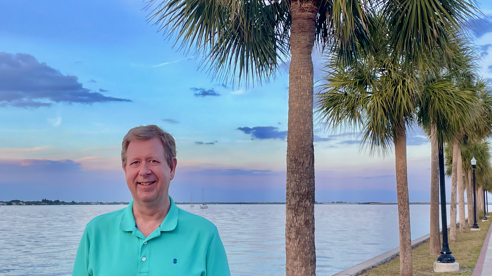

# About David

{ align=left loading=lazy }

I'm a consultant, software developer, and technical editor. Since 2020, I've managed the Technical Communications team at [Constant](https://www.constant.com/), a cloud infrastructure provider with 25 global locations.

The pandemic closed my business, ProtectBits, which delivered technical solutions to government, business, and non-profit clients for 16 years. Before founding ProtectBits, I led teams at Levi Strauss & Co., Thomson Reuters, and Corel.

I'm an advocate of [plain language](https://www.archives.gov/open/plain-writing/tips) and [inclusive naming](https://inclusivenaming.org/). I'm skilled in web development, hardware repair, network administration, database design, and more &mdash; you'll [find my resume here](/resume).

My current hobby project is [lultr.com](https://www.lultr.com), a dad joke website written in Next.js and React. I enjoy racing sailboats whenever possible and I'm a fairly mediocre guitarist.
