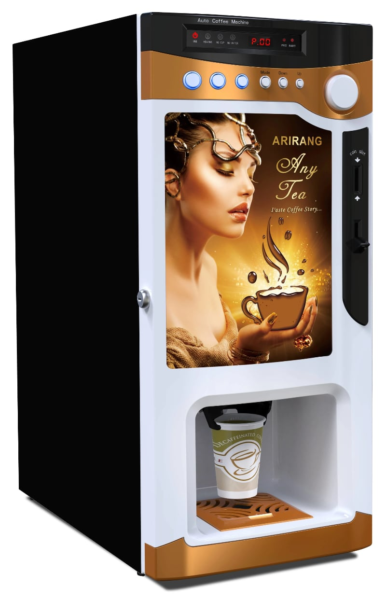

# My Favorite Coffee Roasters

!!! info
    These are my favorite roasters, but i'm always looking for more great coffee suppliers. If you know of one I should try, [please send me a note!](mailto:david@fortc.com)

{ width=50% align=left loading=lazy }

Many years ago, I worked at a place with a free "coffee" machine. You could select regular or decaf, and add "cream" or sugar. After you pressed `Start`, a paper cup dropped down with a familiar plop, followed by a dump of instant coffee and some lukewarm water.

It was dreadful. That's the only word for it. It inspired dread. However, it was free, and it was at the end of the hallway. I didn't know anything about coffee back then. I was a young programmer that lived on junk food and free snacks.

That was the first coffeAs a starting place, 
