## Covert a Rancilio Rocky to Doserless

I didn't like the doser attachment on my coffee grinder. Here's how I replaced it with my own design.

A few years ago I ran a small coffee roasting business on the side and needed a medium-duty grinder. I chose the Rancilio Rocky, which comes in two configurations: with or without an espresso doser. I chose the doser model.

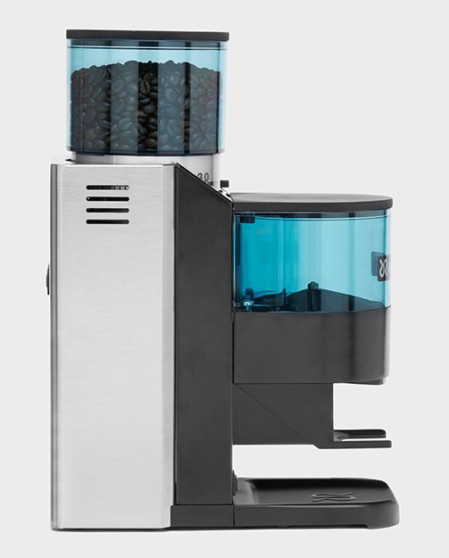

However, I discovered that I wasn't making much espresso and the doser was annoying. I considered buying the official parts to convert it to doserless, but I didn't like the configuration of the chute. It looked hard to clean and people reported static cling issues with the plastic.

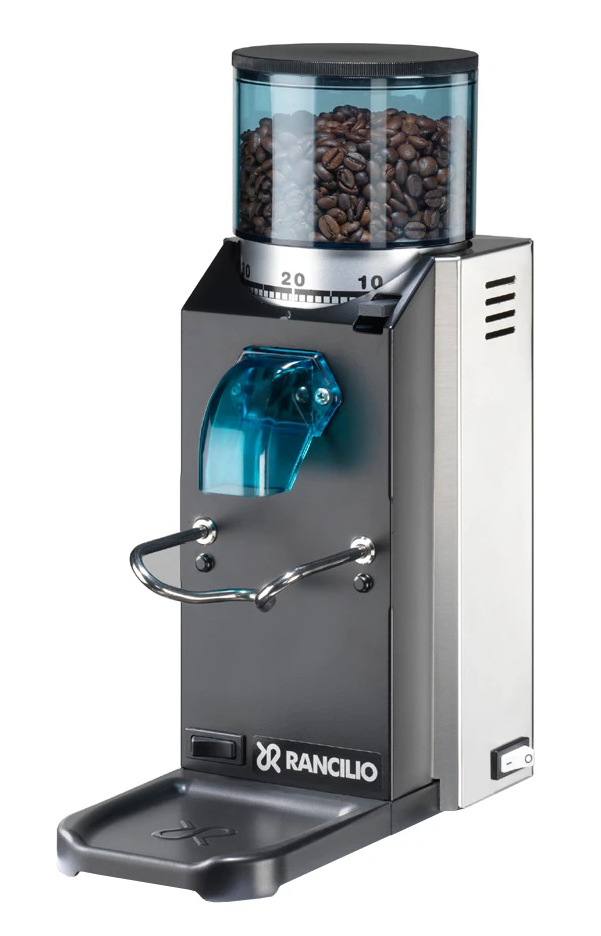

I decided to design my own doserless conversion. Inspired by the shape of the spout on a salt container, I made several cardboard templates. After a lot of trial and error in cardboard, I came up with this design:

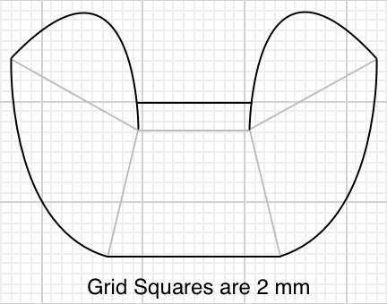

Here is [a chute diagram in PDF](media/RockyChute.pdf) format, and [another in OmniGraffle](media/RockyChute.graffle). The grid squares are 2mm. Print that to scale and transfer to lightweight aluminum sheet. Cut on the dark lines, fold on the light lines, and you'll make this:

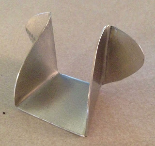

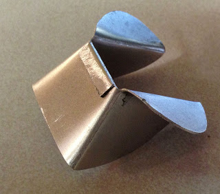

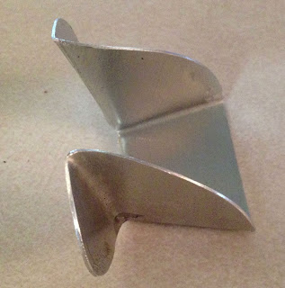

To install your homemade chute, first remove the doser. You'll have to disassemble the grinder to get to the screws from the inside. With the doser removed, you'll see there is a gap in the bean chute.

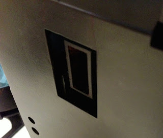

The doser had a protrusion to deal with this gap. Rancilio makes a plug to fill the gap on the doserless model, I found one here [for about $12.00](http://www.espressoparts.com/MR_3699).

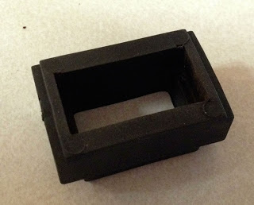

Here's the plug installed in the gap.

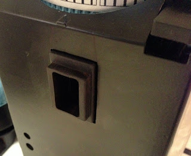

Drill a couple pilot holes and use sheet metal screws to attach the chute, which also holds the rubber plug in.

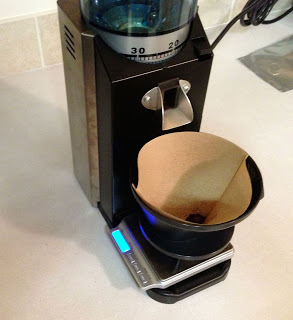

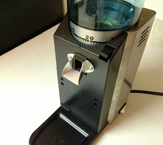

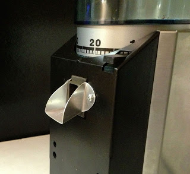

Now the grinder is easy to clean, the metal chute cured the static cling problems, and it's more suited for a home user.
