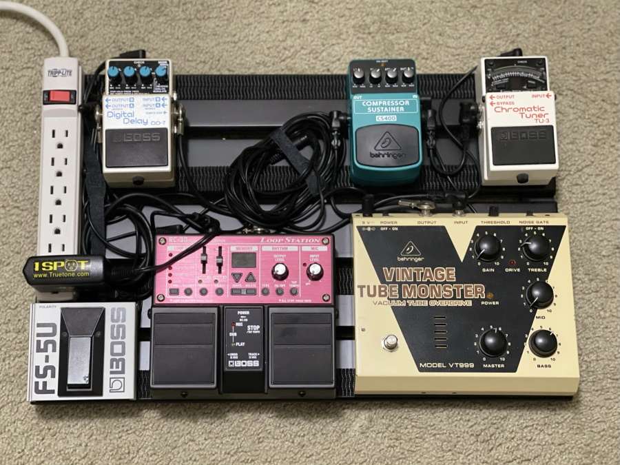
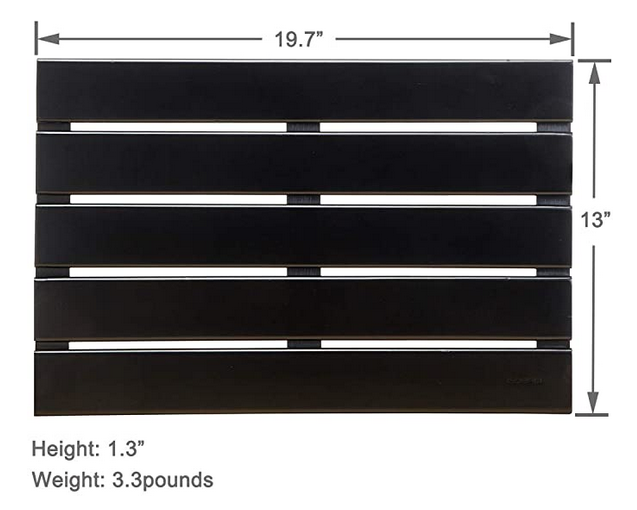

> Here's a fun project! Let's use a bamboo shower mat and heavy-duty velcro to make a guitar pedalboard.

<figure markdown>
{ loading=lazy }
<figcaption>The assembled pedalboard</figcaption>
</figure>

I needed a small pedalboard for the spare bedroom. I don't play on stage and when I drag my equipment to a friend's house, it needs to be as portable as possible. Everything I found online was too big and expensive for what I needed.

One day I stepped out of the shower, looked down at the bamboo showermat, and suddenly realized that would be perfect, if I could find one painted black so the velcro would stick better. A quick search turned this one up:

<figure markdown>
{ loading=lazy }
<figcaption>The bath mat I used</figcaption>
</figure>

You'll probably find this one if you search for "[Bamboo Bath and Shower Mat(19.7 x 13 inches), Non-Slip, Black](https://duckduckgo.com/?q=Bamboo+Bath+and+Shower+Mat(19.7+x+13+inches)%2C+Non-Slip%2C+Black)". 

You might want the next size larger, but I deliberately chose a small one. 

All the guitar forums seemed to be raving about 3M Dual Lock velcro &mdash; which is darned expensive &mdash; but I decided there's no point in cheaping out on that detail, so I bought a [10-foot roll of one-inch SJ3550](https://www.3m.com/3M/en_US/p/d/b40068930/). I planned it out carefully, and ended up using 8 feet of velcro total.

In the end, I saved a few bucks, and the result is better suited to my needs than any pre-built pedalboards I found. The total: **$38 and an hour of my time.**

!!! note "Updated June 2022"

    The 3M velcro turned out to be a great decision. It's rock-solid, you need a crowbar to get the pedals off. The adhesive hasn't budged in two years. 
    
    However, inflation has really kicked in. The total cost of the showermat and 3M Dual Lock at Amazon is now $62, plus tax. I'm not sure I'd do it again at those prices. But, then again, I haven't priced actual purpose-built pedalboards recently. :scream:
