## Introduction

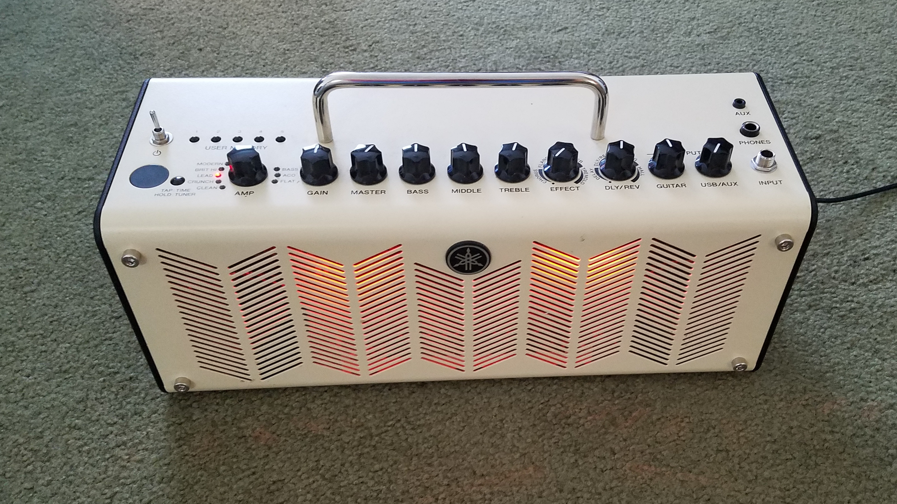{ width=50% align=left loading=lazy }
The Yamaha THR-series are really excellent portable guitar amps, except for one small detail: they have a fragile power connector. One afternoon while traveling, I knocked mine off the table with the power cored attached, and it cracked.

Because these amps can run on external AC power or an internal battery, the power plug has an internal switch that disconnects the battery pack when you insert the power cord.

 

[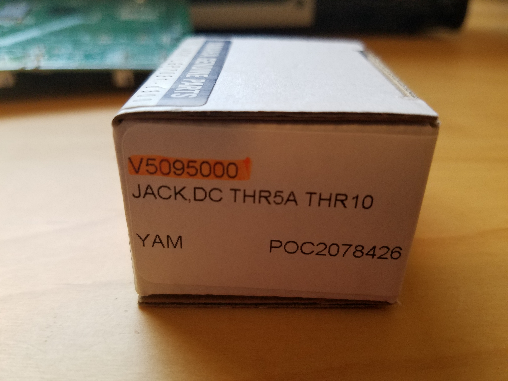{ width=50% align=left loading=lazy }](media/Yamaha-DC-Jack-PN-V5095000---SMK-PN-LGP7031-0300---box-side.jpg)

It took me a little research to find it, but I finally located one. It's a Yamaha part number V5095000.

SMK is the OEM for Yamaha, and this part is also known as an SMK LGP7031-0300.

 

[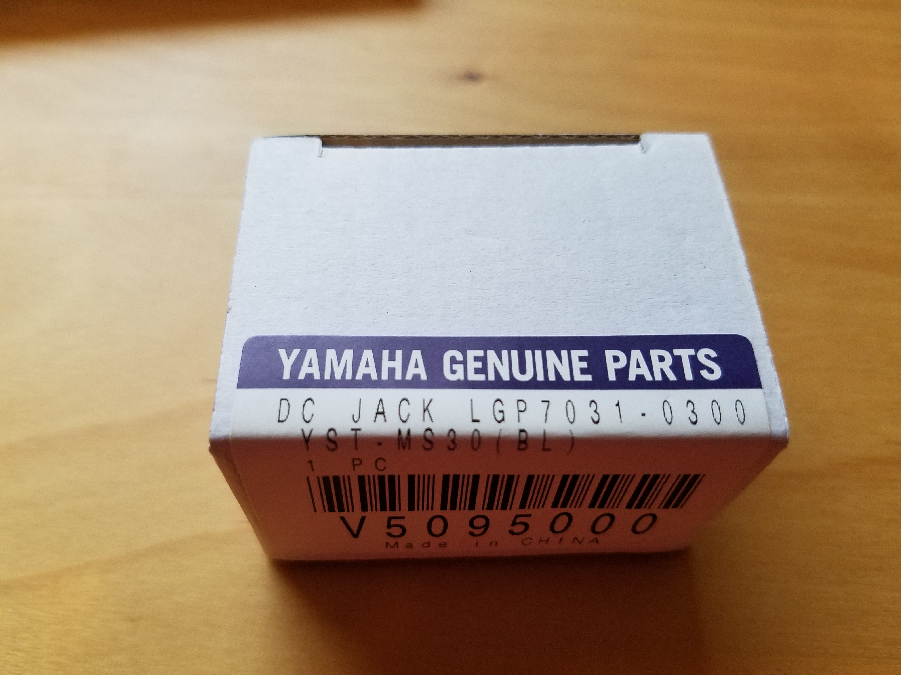{ width=30% loading=lazy }](media/Yamaha-DC-Jack-PN-V5095000---SMK-PN-LGP7031-0300---box-top.jpg)
[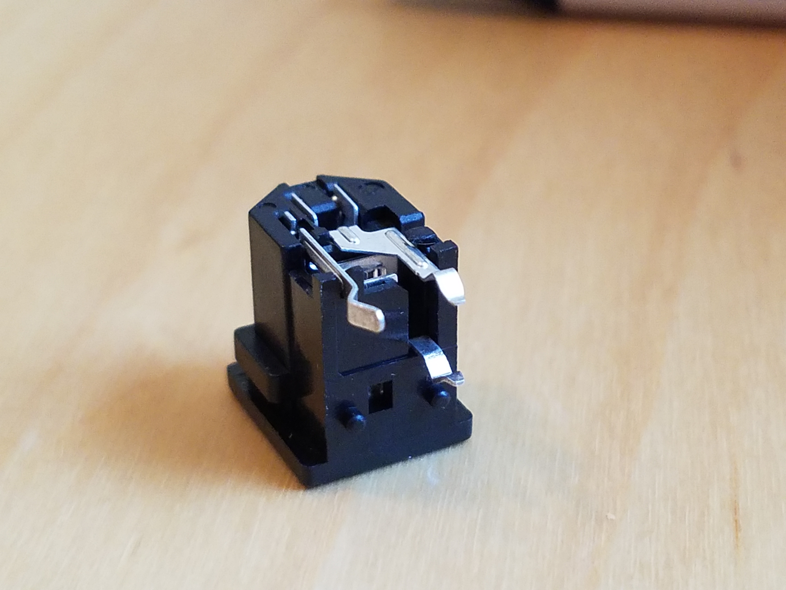{ width=30% loading=lazy }](media/Yamaha-DC-Jack-PN-V5095000---SMK-PN-LGP7031-0300---base.jpg)
[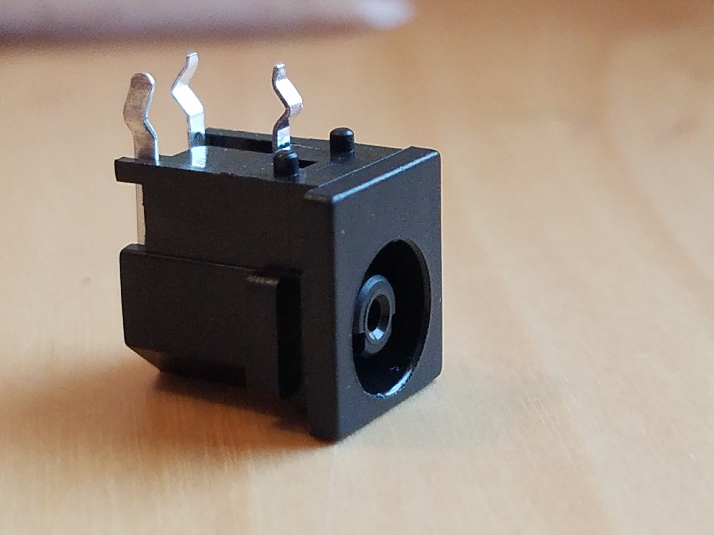{ width=30% loading=lazy }](media/Yamaha-DC-Jack-PN-V5095000---SMK-PN-LGP7031-0300---front.jpg)

 

## How to repair a Yamaha THR-10

[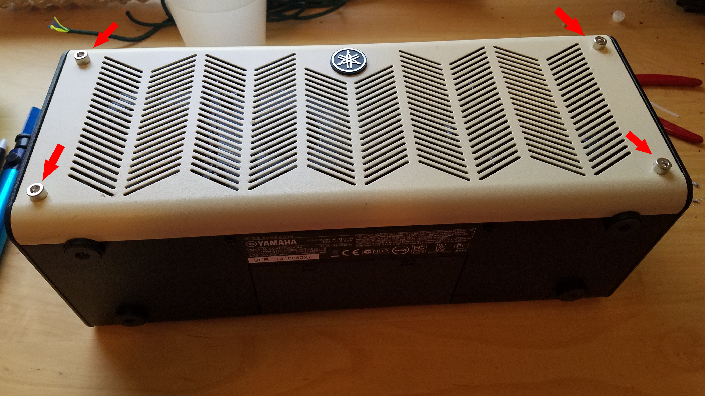{ width=50% align=left loading=lazy }](media/01---Remove-the-four-hex-screws.jpg)

First, remove the four chrome hex nuts from the front.

 

[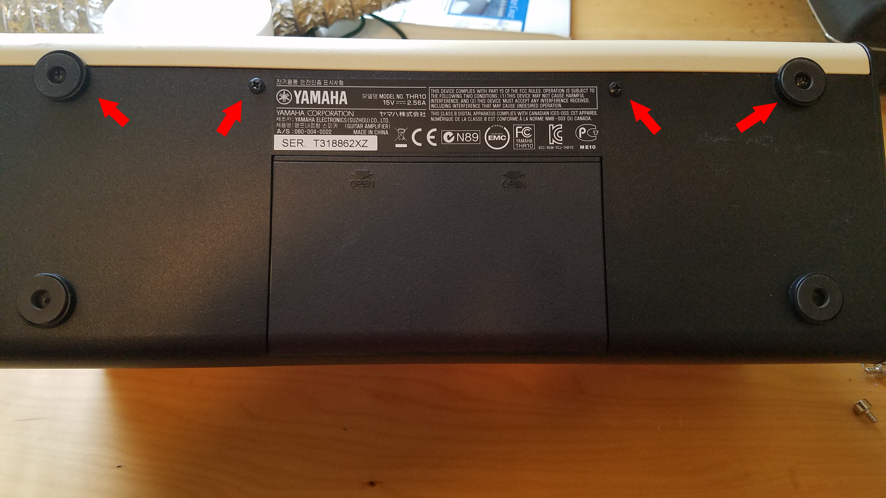{ width=50% align=left loading=lazy }](media/02---Remove-the-4-black-screws.jpg)

Remove the four indicated screws from the bottom.

 

[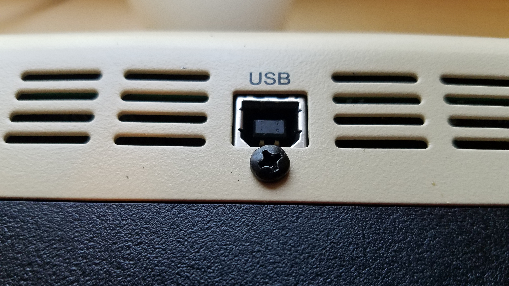{ width=50% align=left loading=lazy }](media/03---Remove-the-USB-hold-down-screw.jpg)

Remove the screw under the USB port in the rear.

 

[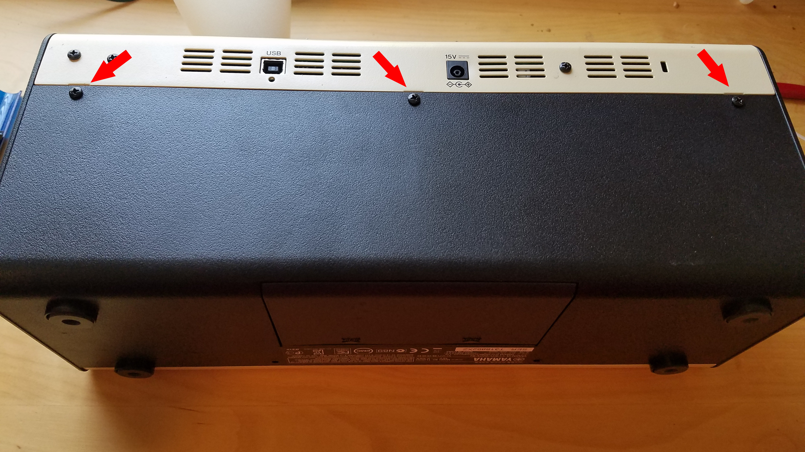{ width=50% align=left loading=lazy }](media/04---Remove-the-other-black-screws.jpg)

Remove these three screws in the rear.

 

[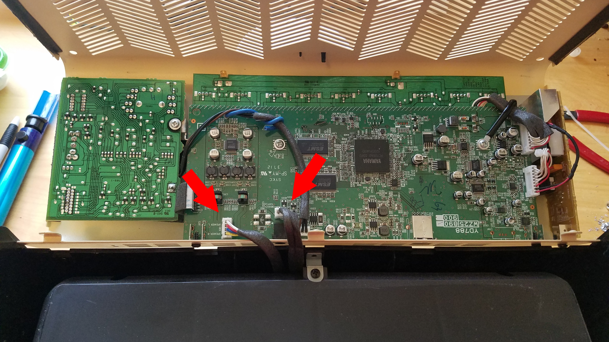{ width=50% align=left loading=lazy }](media/05---Unplug-the-two-cables-connecting-two-halves.jpg)

Unplug these cables and separate the top from the speaker base.

 

[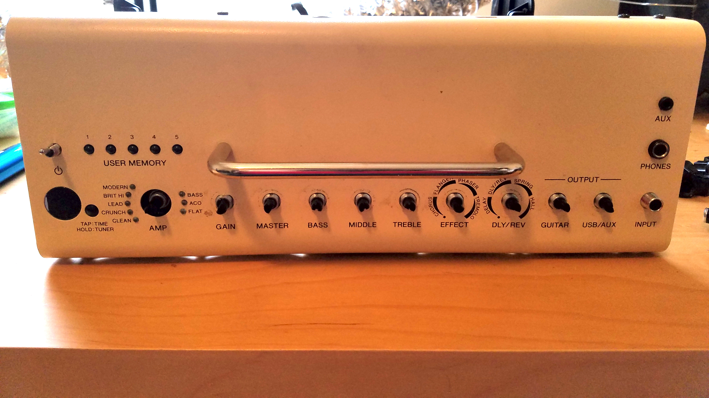{ width=50% align=left loading=lazy }](media/06---Remove-the-nuts-and-washers-for-each-knob.jpg)

Remove all the knobs, nuts, and washers from the top controls.

 

[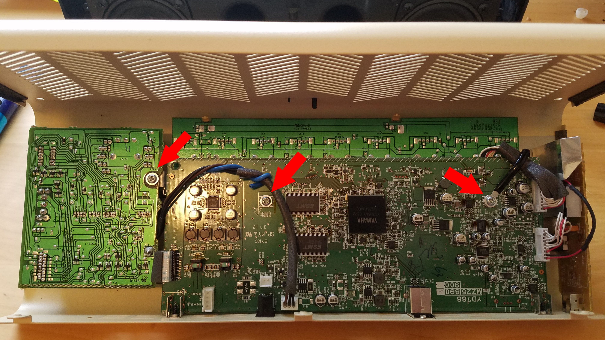{ width=50% align=left loading=lazy }](media/07---Remove-the-three-silver-screws.jpg)

Remove the three chrome hold-down screws.

 

[{ width=50% align=left loading=lazy }](media/08---Unplug-these-two-cables.jpg)

Unplug these two cables to separate the main board from the side board.

 

[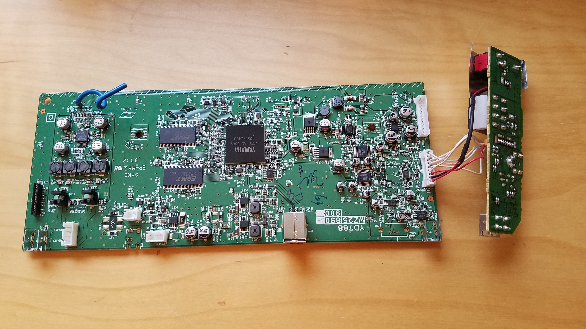{ width=50% align=left loading=lazy }](media/13---The-liberated-board-on-the-bench.jpg)

Pull the board out and place it on your solder station.

 

[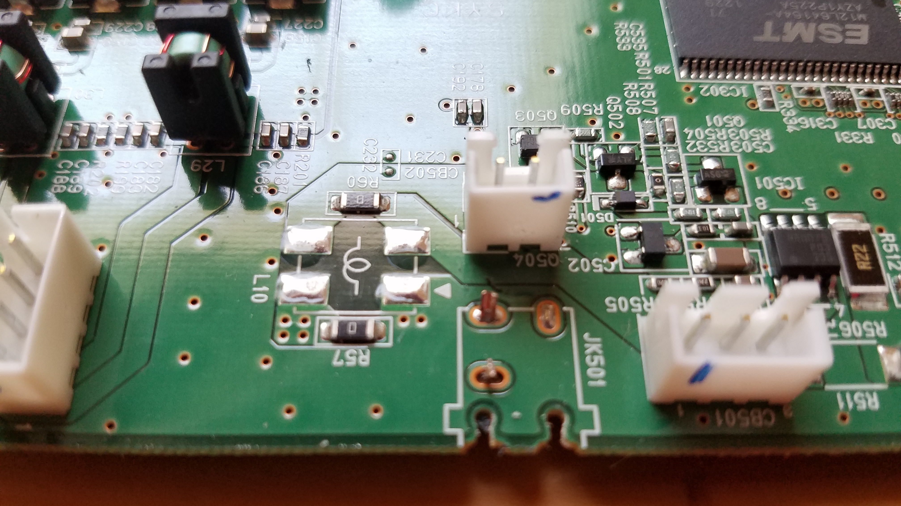{ width=50% align=left loading=lazy }](media/14---JK501-is-where-the-plug-was.jpg)

The power plug is in position JK501. Cut the plug apart to get down to the leads.

 

[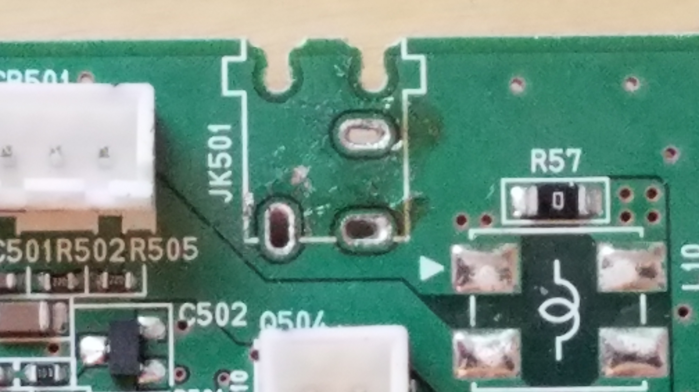{ width=50% align=left loading=lazy }](media/15---Holes-cleaned-and-ready-to-replace.jpg)

De-solder the leads and remove the plug.

 

[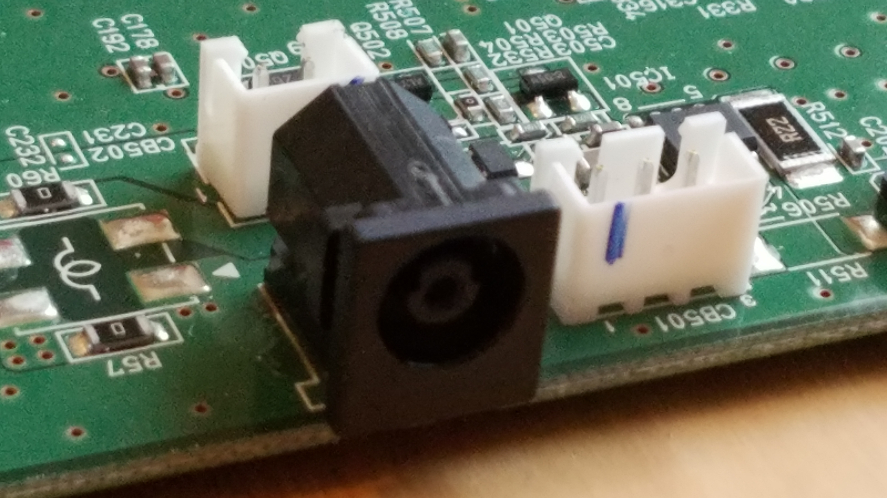{ width=50% align=left loading=lazy }](media/16---Solder-job-complete.jpg)

Install the new plug.

 

## Optional: Preventative Fix

[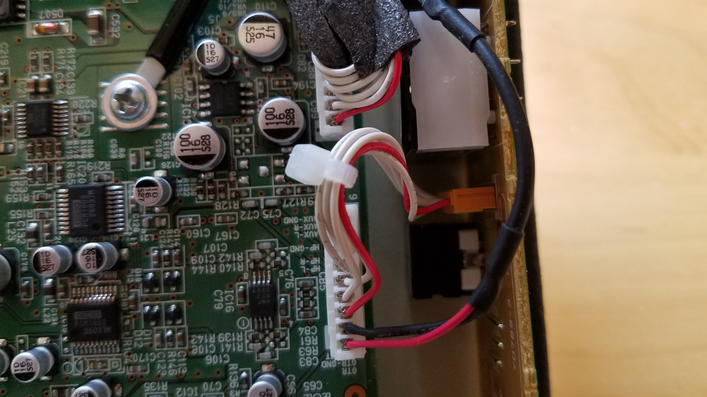{ width=50% align=left loading=lazy }](media/17---Optional-Tie-Wrap.jpg)

Some amps make a squealing sound if the wires on these two connectors touch. Here's [an article at pickroar.com with a preventative fix](http://pickroar.com/1203/yamaha-thr10-squealing-noise-fix/) you can install with a tie-wrap while you have it disassembled.

 

[{ width=50% align=left loading=lazy }](media/18---Finished-and-powered-up.jpg)

Reassemble the amp and power it up.

 

---

If you have some patience and basic soldering skills, this is not a difficult do-it-yourself project. The parts cost less than shipping it back to Yamaha. As you can see by the phots above, my soldering skills are very rusty. But, my amp works fine now and I'm happy.

Good luck!
