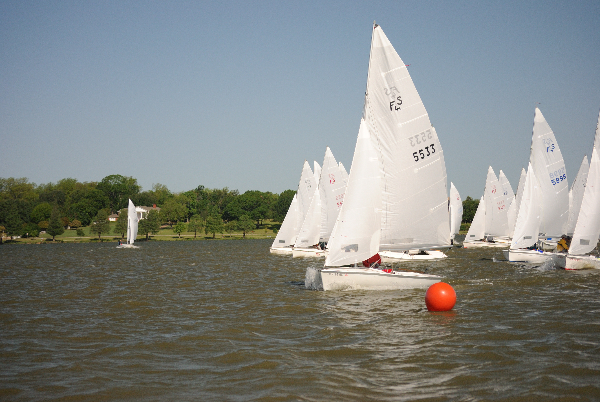

# Corinthian Sailing Club

<small>A shifty mudhole that trained Olympians</small>

[Jump to the photo galley.](#photo-gallery)

## Let's Learn to Sail

When I was ten years old, my parents and I would picnic at White Rock Lake to watch the afternoon sailboat races. My parents thought this looked like fun. Instead of taking a class or asking for help, they got some library books about sailing and bought a [Lido 14](https://sailboatdata.com/sailboat/lido-14).

My dad *always has to be the smartest person in the room*. He didn't want to ask for help, or knock on the sailing club door to introduce himself like some landlubber idiot, so he did the most Al Finster thing possible. He planned to *sail up to the club* and introduce himself, even though he actually *was a landlubber idiot*. Chaos ensued.

On our first outing, we hitched the boat to the car, drove to the lake, and launched it at the public ramp about mid-distance between the [Corinthian Sailing Club](https://cscsailing.org/) (CSC) and the [White Rock Boat Club](http://whiterockboatclub.com/history-of-white-rock-boat-club/). As it turned out, the southerly breeze that day was a crucial factor in our choice of club membership, because sailing downwind was easier to learn out of a book.

He told us to get in the boat, and all five of us climbed aboard. The Lido 14 is a boat designed for two adults who presumably know how to sail. But, unfortunately, we didn't, and we were also overloaded, with three on one side and two on the other. I remember my mom sitting on the leeward side, holding my youngest brother, still in diapers.

That morning, the wind was gusting around 20 knots. (Summertime weather in Texas can be unpredictable. This will become important later.) We raised the sails and managed to get away from the dock without capsizing. We bore away to a very broad reach and took aim at the long finger-dock extending from the main clubhouse at the CSC.

Approaching a dock in a dingy from upwind is a common maneuver. You sail dead downwind past the end of the dock, then turn the boat 180 degrees, directly into the wind to slow down. If you know your boat's handling characteristics and time it properly, you coast to a gentle stop a few inches away from the dock. Your crew steps off the boat victorious, with a bow-line in hand, and ties up quickly before the boat drifts backward.

But, this is not what happened.

## Arrival

Instead of a competent approach, we took aim at the windward side of the dock while moving at full power on a broad reach. At the last second before the crash, my dad realized his mistake and turned. We capsized and came to rest with the boat slowly sinking, held up by the flogging sails scraping along the splintered boards and rusty nails of the Corinthian Sailing Club dock.

The usual Saturday crowd had assembled at the clubhouse to prepare for the afternoon races. As they witnessed this unfolding disaster, many ran to help us get the sails down and the boat upright. They fished us out of the water, pushed the boat to the correct side of the dock, and tied it up.

We had arrived. I didn't know it that day, but some of the folks who helped us during that crash would play pivotal roles in my life over the next several years.

## The Welcome

As is traditional when sailors meet idiots, they offered my parents beer and shelter out of the wind. After the shock wore off, my father said he'd like to join the club. Because the Lido 14 fleet was hungry for new members, and his new boat was still functional despite the scratches it suffered, they invited my parents to race with the fleet that afternoon.

I was invited to crew on the fastest one-design racer on the lake, a [Melges M-20](https://sailboatdata.com/sailboat/m-20-scow) scow. A club member volunteered to watch my two younger brothers, ages 6 and 3. My father now had a couple of beers whispering to him that this was a good idea.

The wind was dying as they pushed off to join the race, and I continued down the dock to step onto my first racing scow. As is tradition, the skipper handed me a can of Heineken as soon as my parents were out of sight.

## The Race

Aboard the M-20, we ghosted toward the start line in a five-knot breeze. We didn't pay too much attention to the thunderheads building in the distance, because that's common in Texas.

My job was simple: put my feet in the hiking straps, and hang on. Because the wind had died and rotated, we were sailing an unusual course with two permanent marks on the east shore (A and B), and a temporary mark made from a mushroom anchor and a [Hoppity Hop](https://www.google.com/search?q=hoppity+hop), designated "X" on the course board. The course was a double triangle, upwind finish — B - A - X - B - A - X - B.

We completed the first triangle in first place, turned back upwind, and the wind died. When we finally rounded the weather mark for the second time, the spinnaker wouldn't fill. I spent the next few minutes looking at the deflated chute draped over our forestay, admiring the glassy water, sipping my beer, and looking at the towering thunderhead that had built on top of us. Pretty cool day for a ten-year-old.

## The Storm

The water got dark near shore as the first downdrafts hit. Suddenly, my skipper was debating if we should take down the chute or try to fly it. We chose to fly it, and the squall hit like a truck. The chute popped open, we slid our weight to the stern, the bow came up, and the boat *took off*. We hit the speed where an M-20 starts shooting water straight up the bilge-board slots, and the whole boat hums from rudder cavitation. It probably wasn't much more than 12 or 14 knots, but it feels like 50 when you are hiked out with a wall of spray tearing your hat and sunglasses off.

We approached the dock, dropped the chute, and deftly performed the previously described 180 docking maneuver. The skipper ran forward to secure the bow-line as the foredeck crew dropped the sails. We had everything secured just as the wall of rain hit. It came in blinding sheets that beat the waves flat and disguised how hard the wind was blowing.

## The Aftermath

The Lido fleet was scattered. Some capsized, some managed to make it back.  My parents turtled their boat and stuck the mast-tip in the mud which gave the waves leverage to beat the boat until the mast crumpled. A rescue boat arrived to pull my parents out of the water and they abandoned the boat temporarily.

After the squall, they went back in a crash boat to retreive the Lido and its broken rig. They towed it back to the dock and gave my dad a ride to retrieve our car and trailer left behind at the public ramp. That evening a fleet member loaned my dad a new mast so he could come back and race the next weekend, proving that sailors are kind even in the face of obvious idiocy.

We joined the club and began sailing every weekend. I don't know why my dad came away from that experience with the courage to try again, but I know why I did — I could go fast on the water, and adults would feed me beer. I was hooked.

## The Lake

White Rock Lake is a small, shallow, muddy, polluted body of water near downtown. The primary source is White Rock Creek, which collects all the nitrogen-laden storm runoff from North Dallas. If you get a cut while sailing, you are guaranteed an infection. If you capsize the boat in the north end of the lake, you'll stick the mast in the mud. It's only chest-deep in that area; you could walk across it, except you'd sink to your knees in silt. Anyone who sails there regularly has a classic brown stain on the top few feet of the mainsail. There's a dedicated sail-scrubbing area on the north dock where people attempt to remove the mud after capsizing.

Despite this, or because of it, this lake is a place of champions. The wind is shifty as it whips off the surrounding hills. The lake is roughly hourglass-shaped, with a north lobe and a south lobe and two prominent points that bend the wind. If you learn the read the water, it has many tactical opportunities. When I sailed there, more than one member represented us in the Olympic Trials, and a couple made the team. On the race management front, CSC had many senior judges sanctioned by the United States Yacht Racing Union (USYRU), which later renamed itself to [US Sailing](https://www.ussailing.org/). Despite my father's arrogant and unwise entrance to the sport, he became an excellent sailor and earned a position as senior USYRU judge.

I also became a certified race officer, but never pursued the judge program for race management or equaled his standing in the judge community.

## Leukemia Cup Regatta

The Leukemia Cup Regatta in Dallas is a two-weekend event which raised over a million dollars for the Leukemia Society during its 10-year history. The first weekend is a keelboat event at Rush Creek Yacht Club. The second weekend is dingy sailing at White Rock, and I worked on the Race Committee for several of these events. Here are some photos I took at the 2010 dingy weekend at Corinthian Sailing Club.

## Photo Gallery

Bird-eye view of a Flying Scot class sailboat

---

Corinthian class sailboat

---

Friday night sailing before the event

---

Friday night sailing before the event

---

Friday night sailing before the event

---

Skippers Meeting

---

Starting line sequence 1 of 7: Notice 5533 has carved out a hole for themselves at the near end of the line.

---

2 of 7: #5533 continues to drive toward the pin. They appear to be late in this photo, but it's deceptive because they are reaching at full speed while the rest of the fleet is slower.

---

3 of 7: The gun has been fired. #5533 is still reaching at full speed while the boats at the other end are moving slower, hard on the wind.

---

4 of 7: #5533 has crossed the line and begins to round up.

---

5 of 7: It's a promising start for #5533, they have clear air and momentum.

---

6 of 7: Something goes wrong. #5533 is luffing the main and slowed down.

---

7 of 7: A good shot of the gap between the aces at the front of the fleet and the rest. The starting line is between the orange flag and the Hoppity Hop.

---

The Flying Scot fleet approaching the leeward mark.

---

The leaders are around the mark.

---

The leaders sail away as the rest of the fleet approaches.

---

Sometimes it gets wild.

---

And sometimes, you don't make it.
