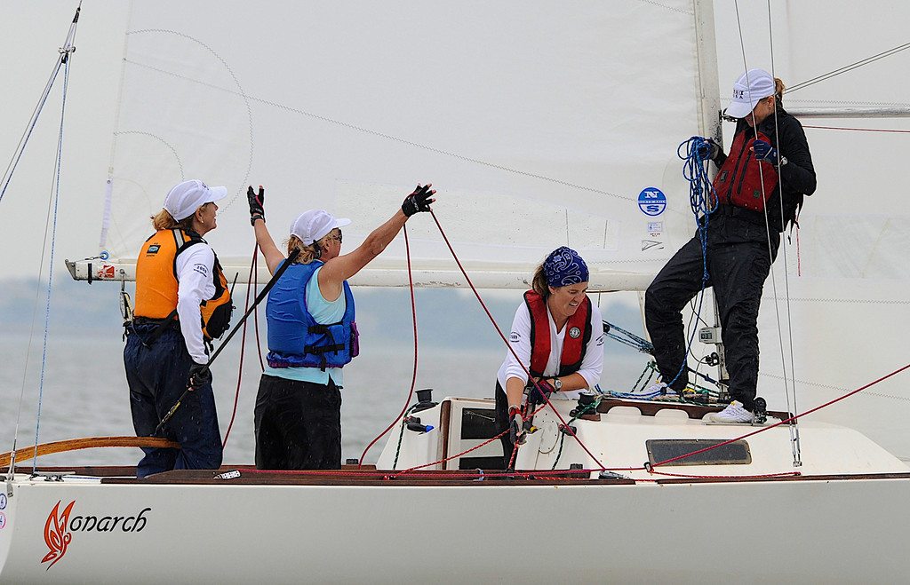

Gayle and I purchased this boat in 2007 from a charter fleet at the Rolex International Women's Keelboat Championship (RIWKC) in Houston. The boat was stiff and light. I had to add 40+ pounds of lead to bring it up to minimum weight. It also needed new rigging, winches, cleats, and more, so we spent the winter refitting it. We raced it for a few years at local and national events, and the boat was always very quick. 

Freshly applied Monarch graphic

Here is Monarch at a few different events with a mixture of crews.

## 2009 Midwinter Championship at Dallas Corinthian Yacht Club

 
David taking a wind measurement

 
Getting ready to start

 
Relaxing between races

## Gayle and Team at the 2009 North American Championship

Gayle put together a team for the 2009 J/22 North American Championship. 

 
Gayle is the cute brunette in orange wearing sunglasses.

 
Sorry, I meant the smart one on the right.

We got some good photos from that event.

 
Looking good upwind

 
Gayle and Team Monarch

 
Scoping out the layline

 
Backstay on

 
More backstay!

 
Weather mark approach

 
Pole up

 
Hoist!

 
Pole back...

 
Jib down, pole back!

 
Everything is loose, why won't it fill?

 
More mainsheet

 
Finish line approach, looking sharp

 
Thank you, race committee!
