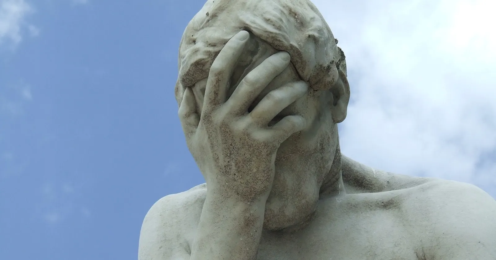

!!! Quote "&nbsp;"
    Muphry's Law is the editorial application of the better-known Murphy's Law. Muphry's Law dictates that:  
    
    (a) if you write anything criticizing editing or proofreading, there will be a fault of some kind in what you have written;  
    (b) if an author thanks you in a book for your editing or proofreading, there will be mistakes in the book;  
    (c) the stronger the sentiment expressed in (a) and (b), the greater the fault;  
    (d) any book devoted to editing or style will be internally inconsistent.

    &mdash; John Bangsund, in [*Society of Editors Newsletter*](https://web.archive.org/web/20080720221038/http://home.pacific.net.au/~bangsund/muphry.htm), March 1992

{ loading=lazy }
