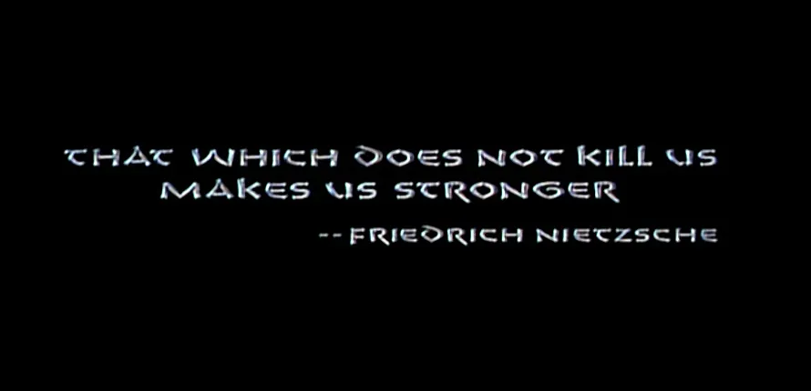
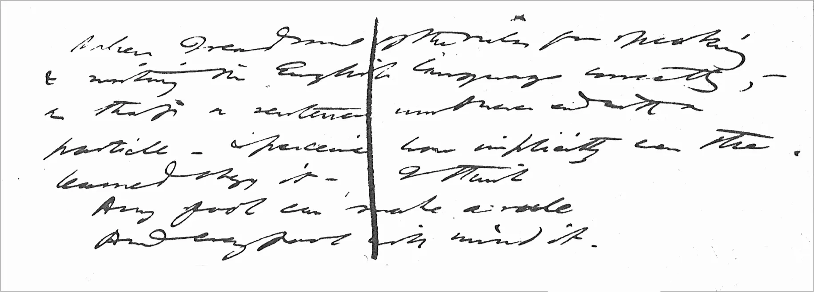

{ width=50% align=left loading=lazy } 

I use a simple mnemonic device to remember when to use **which** and when to choose **that**. If you want the short answer, [jump to the bottom.⬇️](#rule)

Otherwise, let's go on a journey.

---

Here is the basic rule I was taught in school:

* **That** should be used with restrictive modifiers – a word, phrase, or clause that **is essential** to the meaning of the sentence.
* **Which** should be used with nonrestrictive modifiers: a word, phrase, or clause – usually separated by commas – which **is not essential** to the meaning of the sentence.

If you like tables, here's another version:

| **Word** | **What Does It Do?**                                  | **Example**                                                 |
| -------- | ----------------------------------------------------- | ----------------------------------------------------------- |
| which    | Nonrestrictive: adds information                      | The server, **which** needs an upgrade, crashed last night. |
| that     | Restrictive: clarifies what noun you're talking about | The server **that** crashed last night had a disk failure.  |

The movie [*Conan the Barbarian*](https://www.imdb.com/title/tt0082198/) opens with a quote by Nietzsche[1️⃣](#fn1), which when translated into English reads:

> That which does not kill us makes us stronger.

The phrase "does not kill us" is restrictive – without it, the sentence becomes meaningless. But, following the rule creates an awkward double-word construction:

> **That that** does not kill us makes us stronger.

The quote clearly demonstrates that there are times when you **absolutely should** break this rule. But, how do we know when it's okay to break the rule? And, who made up this rule anyway? And, going even deeper philosophically, should grammar prescribe the "proper" use or describe how it's used?

Traditionally, I've been a rule follower. However, this book has really opened up my thinking: *Because Internet: Understanding the New Rules of Language* by [Gretchen McCulloch](https://www.goodreads.com/book/show/36739320-because-internet). It's a fascinating dive into how people use language, and it makes a strong case against overly prescriptive grammar.

After reading that, I think that *it depends*. We do need rules. Without rules and conventions, technical writing is challenging to decipher. But, the point of technical communication is *communication*, so we also have to adapt to the contemporary usage. Things change, and we need to adapt to how people actually read and learn.

For example, I cringe at phrases in documentation like "*head on over to [some URL]*," which I think should be written as, "*navigate to [some URL] in your web browser*." But, if I try to enforce my personal bias, I look like the people who still insist we should teach children cursive handwriting.

And... to imagine a world where only cursive is allowed, take a minute to study this scrawl:

I can't decipher that. But, thanks to the scholars at [UC Santa Barbara](https://thoreau.library.ucsb.edu/project_main.html) who decoded it, I can report that it says:

> When I read some of the rules for speaking & writing the English language correctly,– so that a sentence must never end with a particle– & perceive how implicitly even the learned obey it–I think
>
> Any fool can make a rule  
> And every fool will mind it.
>
> – Henry David Thoreau  
> [Journal Vol. 30, Feb 3, 1860](https://thoreau.library.ucsb.edu/writings_journals30.html)

So who were the fools that decided the rules for **that** and **which**?

[Merriam-Webster](https://www.merriam-webster.com/words-at-play/when-to-use-that-and-which) has a deep dive on this topic. [2️⃣](#fn2) In the 1600s, they were completely interchangeable and everyone seemed happy. In 1906, professional nitpickers Henry Watson Fowler and his brother Francis George published a guideline in their textbook, *The King's English*.

> That should never be used to introduce a non-defining clause.
>
>…Which should not be used in defining clauses except when custom, euphony, or convenience is decidedly against the use of that.

Apparently, this didn't get much traction at first. Henry was still complaining that writers were ignoring his rule in a second textbook published 20 years later. But, by the time I was in Texas public schools, the rule had been absorbed and dumbed down to a blunt instrument. The warning "except when custom, euphony, or convenience is decidedly against" was largely ignored. (They also taught us a dumb rule about how many spaces to put after a period. [3️⃣](#fn2))

Merriam-Webster describes modern usage this way:

> We conclude that at the end of the 20th century, the usage of *which* and *that*—at least in prose—has pretty much settled down. You can use either *which* or *that* to introduce a restrictive clause—the grounds for your choice should be stylistic—and *which* to introduce a nonrestrictive clause.

Thoreau warned us about grammar fools 46 years before the Fowler brothers decided to (ahem) *foul* things up. After reading Gretchen McCulloch's book, I've begun to shift my editing away from "grammar as a prescriptive rulebook" and toward [Plain Language](https://plainlanguagenetwork.org/) that facilitates clear communication. Culture drifts over time, and grammar rules eventually follow.

#### Because...

**_[Rules provide ſtructure and uſually have a reaſonable purpoſe. But, I think it's okay to eaſe up on ſome when it facilitates clear communication. Above all, technical writing ſhouldn't draw attention to itſelf. There's a reaſon we don't use the long ſ anymore.](https://en.wikipedia.org/wiki/Long_s)_**

## The Short Answer

This has been an overly-complicated exploration of a simple question, so thanks for reading. 🙏 

Here's the short version:

<em>If the phrase can be tossed out like a sand**wich** wrapper, use **which**.</em>

On the other hand, either one is fine for a restrictive phrase. Use the one that sounds best, and don't worry. 

[Back to top ⬆️](#top)

---

1. It's not a great translation; I think [Kelly Clarkson's](https://youtu.be/Xn676-fLq7I) version is more faithful to the [original German](https://www.dictionary.com/e/slang/what-doesnt-kill-you-makes-you-stronger/). [↩](#1)
2. If you don't know what *grammar pants* are and have a sense of humor, you should absolutely read their article. [↩](#2)
3. Texas taught us it was two. The correct answer is one. I will die on this hill unless you use monospace fonts on a manual typewriter. And, if you do, can we be friends? You seem cool. [↩](#3)
