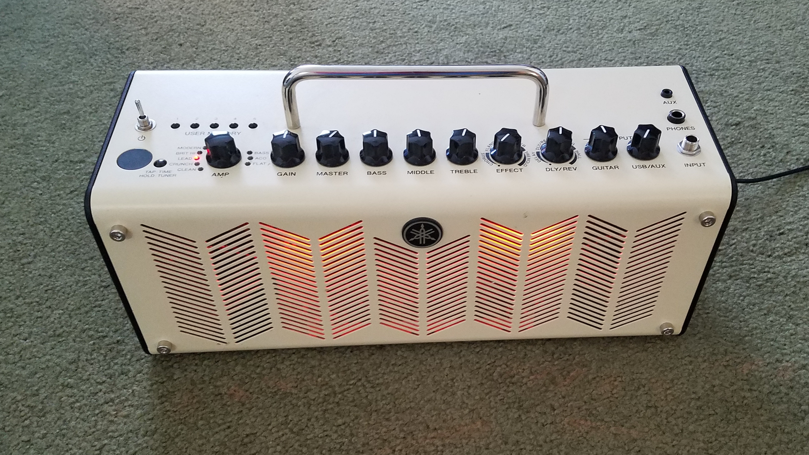

# Repair a Yamaha THR-10 Guitar Amp 

<small>How to Replace a Broken Power Plug</small>

I broke my guitar amp power plug. This is how I fixed it.

The Yamaha THR series of guitar practice amps are portable and run on either AC or battery power. 

They are pretty rugged in general, but the power connector is a little fragile.

It's not just a simple barrel connector like you'd find on most consumer electronics; it has an internal battery disconnect switch when AC power is plugged in.

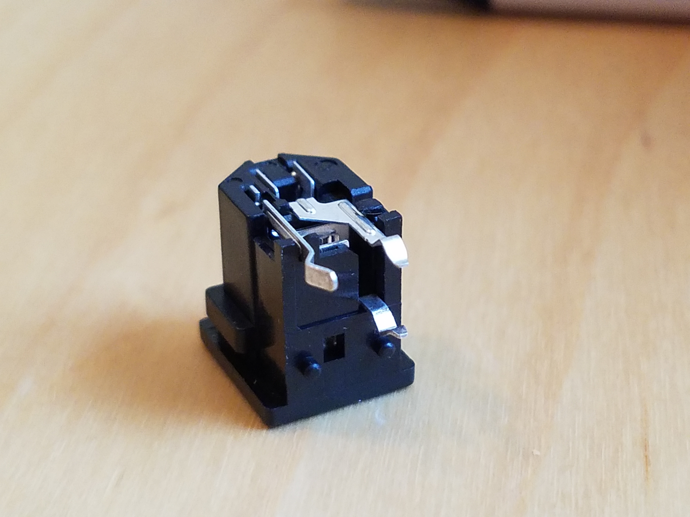

One time when traveling in our RV, my amp fell out of the storage cabinet. I'd stupidly left the power cord connected. The power plug broke when the amp hit the floor.

After a lot of research, I managed to find the part. It's a Yamaha V5095000.

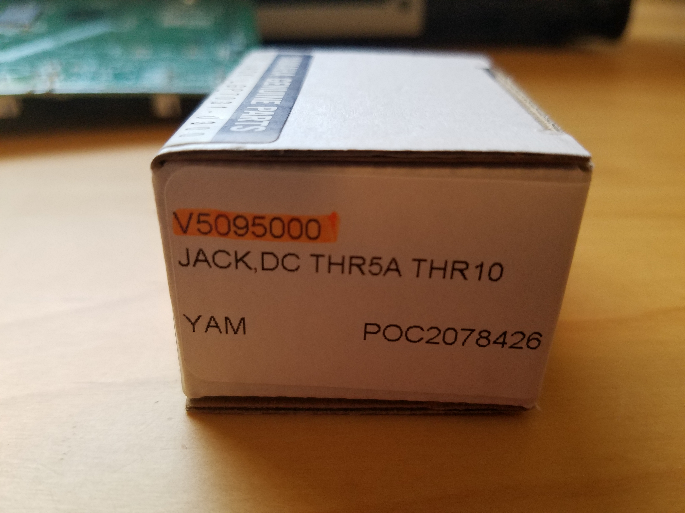

SMK is the OEM for Yamaha. This part is also known as an SMK LGP7031-0300.

Remove the four chrome hex nuts from the front.

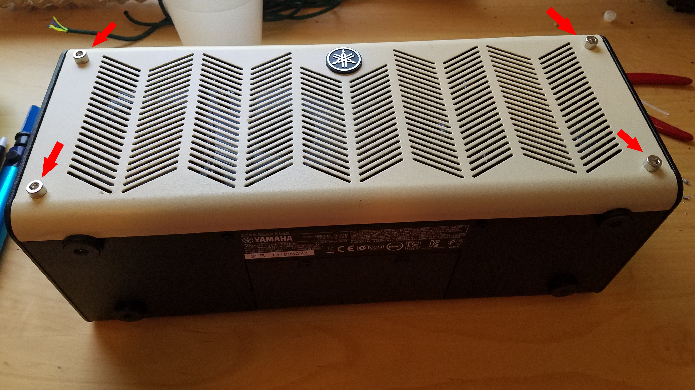

Remove the four indicated screws from the bottom.

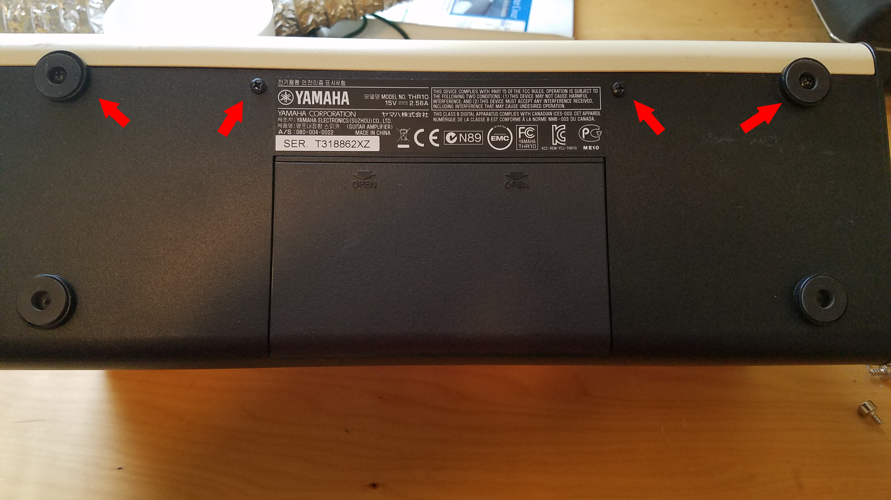

Remove the screw under the USB port in the rear.

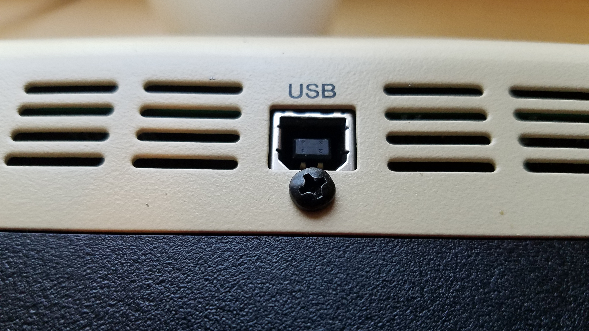

Remove these three screws in the rear.

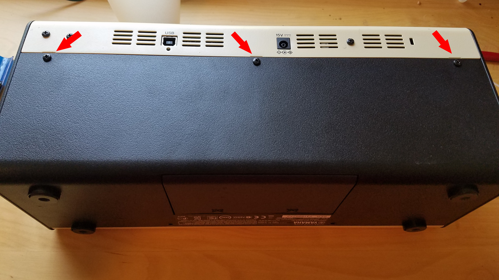

Unplug the indicated cables to finish separating the top from the speaker base.

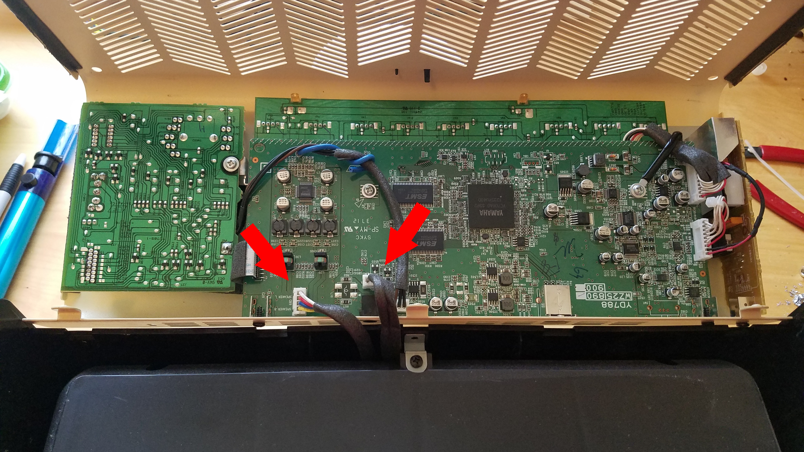

Remove all the knobs, nuts, and washers from the top controls.

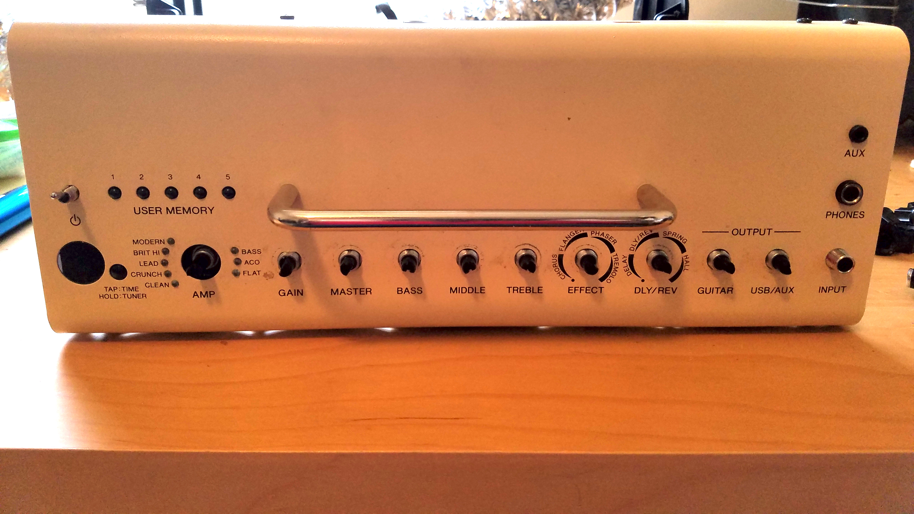

Remove the three chrome hold-down screws.

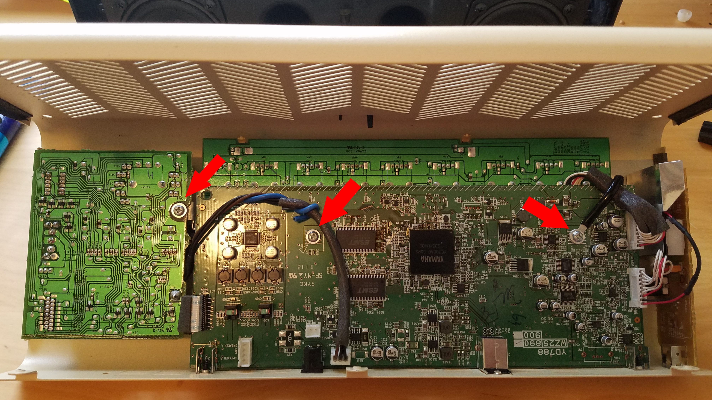

Unplug these two cables to separate the main board from the side board.

Pull the board out and place it on your solder station.

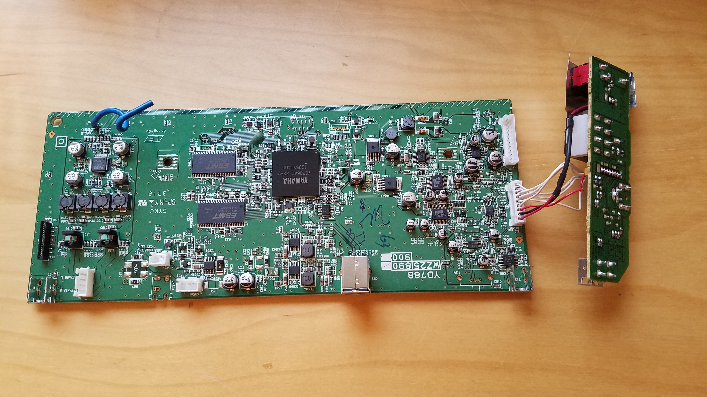

The power plug is in position JK501. Cut the plug apart to get down to the leads.

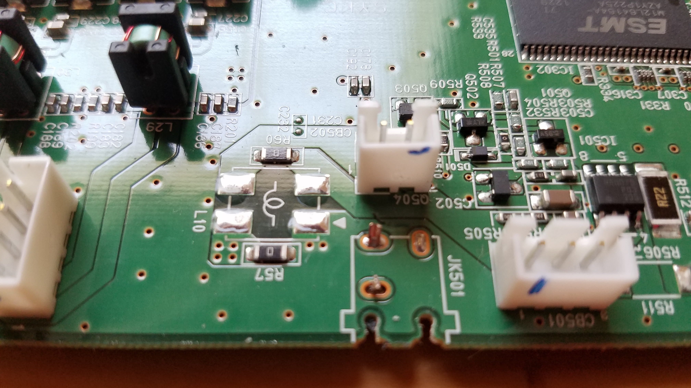

De-solder the leads and remove the plug.

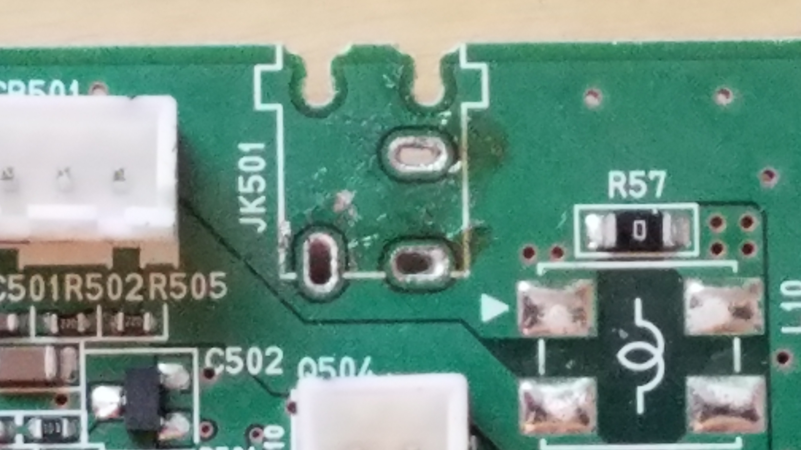

Install the new plug.

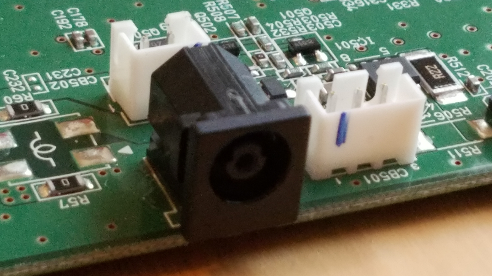

Optional: Some amps make a squealing sound if these two red wires touch. While you have it assembled, you can install a tie-wrap to prevent this.

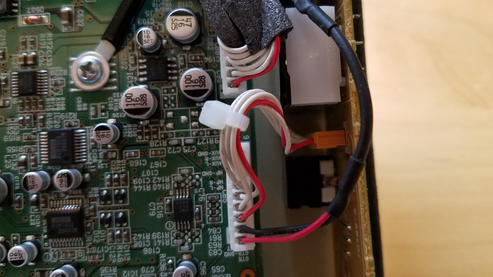

Reassemble the amp and power it up.

It's not a hard repair, and the part is less than $20.

Good luck!
