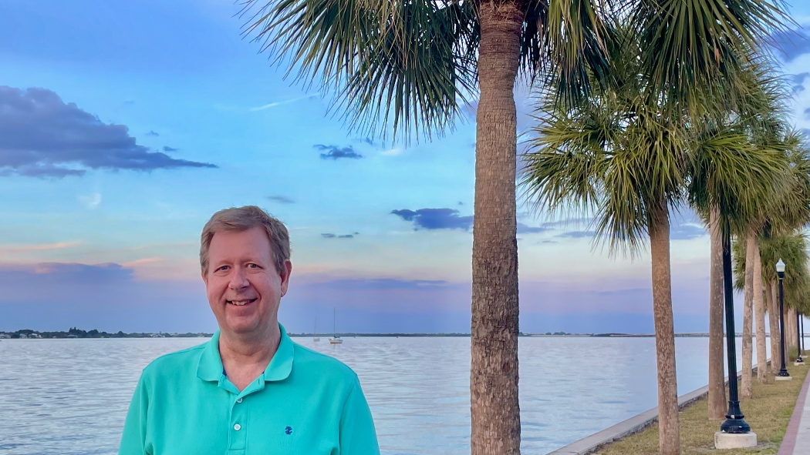

I'm a consultant, software developer, and technical editor. My current gig is managing the Technical Communications team at [Constant](https://www.constant.com/), a cloud infrastructure provider with 25 global locations.

{ width=50% align=left loading=lazy }

At the beginning of the 2020 pandemic, I closed my consulting business that I'd operated for the previous 16 years. I've also led developer teams at Levi Strauss & Co., Thomson Reuters, and Corel.

I'm an advocate of [plain language](https://www.archives.gov/open/plain-writing/tips) and [inclusive naming](https://inclusivenaming.org/). I'm skilled in web development, hardware repair, network administration, database design, and more &mdash; you'll [find my resume here](/resume). I've written a few articles on this site for my own amusement, and I'm always open to discuss interesting technical projects.

My current hobby project is [lultr.com](https://www.lultr.com), a dad joke website written in Next.js and React. I enjoy racing sailboats whenever possible and I'm a fairly mediocre guitarist, but my wife says she doesn't mind my playing too much.

I like small dogs, black coffee, and aged white tea.
