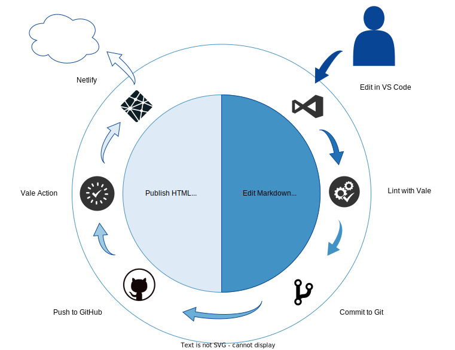

# Doc-as-Code Overview

[Docs-as-Code](https://www.writethedocs.org/guide/docs-as-code/) is a method of writing documentation using the same tools as a typical software development project, like:

* Issue trackers
* Version control
* Plain Text markup
* Code reviews
* Automated tests

When technical writers use the same tools as software developers, it facilitates an environment where both teams feel ownership of the documentation and make asynchronous updates with their native tools. Often, the developers make a first draft of core documentation and hand that off to the technical communications team as Markdown files in Git. The technical communications team uses the draft material to develop FAQs, quickstarts, and reference guides. The documentation review cycle works exactly like traditional code review, with a full fork-branch-merge request workflow.

For the past year or so I've experimented with many tools and I have enough experience to share in a short blog post. Here's a quick overview of the major steps in my workflow.

### Issue Trackers

The issue tracking system you choose will depend mostly on whatever system you already use. There's nothing in a Docs-as-Code workflow that dictates the issue tracking tool. I've tried working with Redmine, Notion, and Jira. **Redmine** is dreadful. Just avoid this at all costs. **Notion** is super flexible. With some custom formulas and creative views, you can use Notion as a simple project management system. I built a reasonably complex workflow in Notion, but I ran into some limits with custom rules and field validation. Overall, it was capable, and it's inexpensive if you are willing to learn how to build Notion templates. Or, you can pay for templates and hire Notion consultants.

**Jira** is... Well, it's Jira. And it's pretty good, even though it sucks. The point is, your choice of tool here doesn't really matter as long as it works for you.

### Version Control

I've focused on Git and GitHub, and use the GitHub runner for Vale lint the site during a merge request.

### Plain Text Markup

Depending on your project, you are probably using some flavor of Markdown or reStructuredText. Markdown comes in many flavors, but GitHub flavor and Commonmark are very popular. Your choice of static-site generator and theme will usually allow some custom markup as well for things like admonishment boxes, graphics with alignment and captions, extended table formatting, and many other examples. These extensions create a potential for lock-in. I've switched themes several times on this website, and it's always a lot of toil reformatting posts and changing out image shortcodes. This is a fairly small site so, if you are planning a large documentation site, you should run a few simple trials with different static-site-generators before you commit. If you decide later to switch from Hugo to MkDocs, it may be a fair amount of work.

I've experimented with Hugo, MkDocs, Jekyll, and Sphinx, and although I see strengths in all of them, MkDocs is suiting my needs right now. Mostly, that's because I'm not as tempted to jump in and start coding new features like I was with Hugo. I can just focus on writing.

## Editing

I use Visual Studio Code to edit Markdown. I've collected [a set of plugins and configurations](https://github.com/vultr/vultr-mdtk) that provide Markdown linting and real-time feedback on formatting and style issues. To generate the site preview, I run `mkdocs serve` in VSCode's terminal and watch the local site in a web browser while I edit.

## Code Reviews

I edit the site in a `draft` branch. When I think it looks good I push that branch to my public GitHub repo. Netlify notices the new branch and triggers a draft site build, which I review at a private URL.

## Automated Tests

Merging the draft branch to `main` triggers a Vale GitHub action, which scans the repo with a custom rule set, linting for grammar and other style guide issues. If the Vale report is approved and the merge request completes, Netlify builds a new public site from the main branch.
